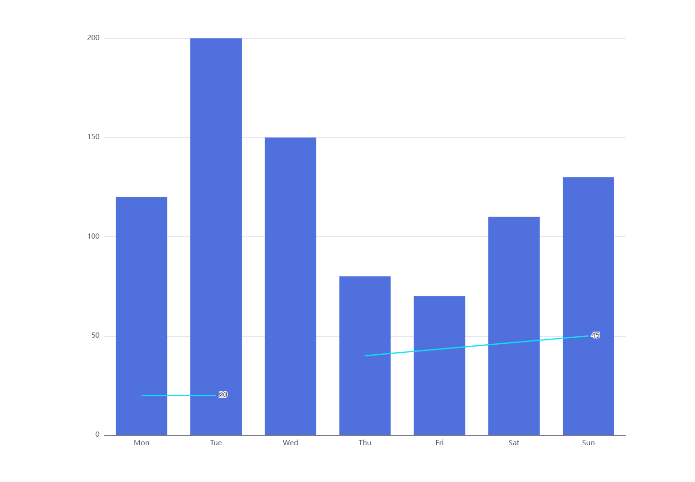

```js
option = {
  xAxis: {
    type: 'category',
    data: ['Mon', 'Tue', 'Wed', 'Thu', 'Fri', 'Sat', 'Sun']
  },
  yAxis: {
    type: 'value'
  },
  
  series: [
    {
      data: [120, 200, 150, 80, 70, 110, 130],
      type: 'bar',
      markLine: {
        lineStyle: {
          color: '#0AE4FA',
          type: "solid",
          width: 2
        },
        data: [
          [
            {
              coord: [0, 20],// 关键点，0表示x轴第一个坐标，也可以用“mon”代替,20表示y轴的数值大小
              name:"本区标准配额",
              value:20,
            },
            {coord: [1, 20]} // 关键点，1表示x轴第二个坐标，也可以用“Tue”,20表示y轴的数值大小
          ], [
            {
              coord: [3, 40],// 可以画多个线，也可以化斜线
              value:45,
            },
            {coord: [6, 50]}  
          ],,
        ],
        symbol: ['none', 'none']
      },
    }
  ]
};
```

